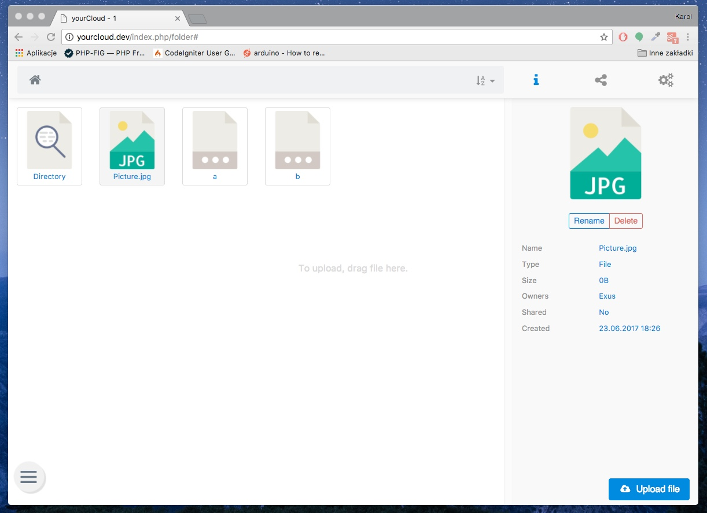

What is yourCloud
=================

yourCloud is a simple open source cloud file system. This app is designed for educational purposes, 
but its development is planned until it is fully functional and can be used without difficulty in own purposes.

Server Requirements
===================

PHP version 5.6 or newer is recommended.

It should work on 5.3.7 as well, but we strongly advise you NOT to run
such old versions of PHP, because of potential security and performance
issues, as well as missing features.

Installation
============

W.I.P

License
=======

MIT

Several screenshots
===================

